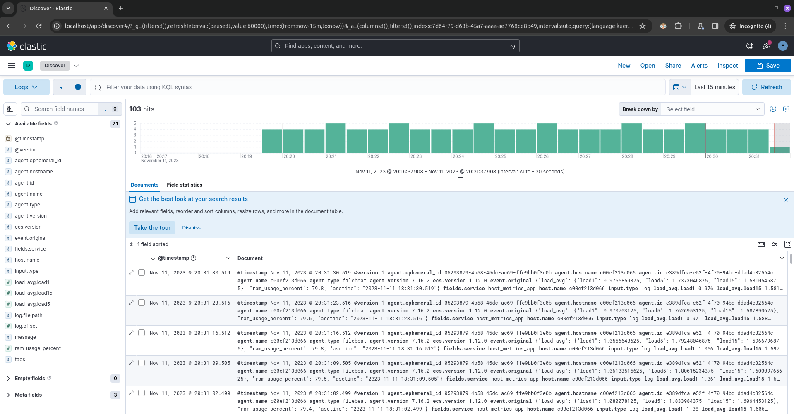

# Setup project
1. Start python app for generate logs - `python3 ./host_metrics_app/main.py`
2. Create `.env` file - `cp .env.example .env`
2. Start docker containers - `docker-compose up`
3. Go to [kibana](http://localhost/)
4. Setup Kibana Dashboard:
- Create index (Discover -> Create data view) 
- Go to Discover
5. See your data 

## Migration to version 8

1. docker-compose up --no-deps elasticsearch -d
2. docker exec -ti <elastic_container>  /usr/share/elasticsearch/bin/elasticsearch-setup-passwords auto
3. Cnange passwords in .env file (it`s better for now using elastic user credentials for logstash)
```
.env file Example
KIBANA_USERNAME=kibana_system
KIBANA_PASSWORD=k6CozHZtToAO3ebjdnEe

LOGSTASH_USERNAME=elastic
LOGSTASH_PASSWORD=82wNYrMS1THAlyhjXwwW
```
4. docker-compose up --no-recreate

TODO: add script for generating passwords, updating .env file and srart docker containers
TODO: delete outdated env variables in docker-compose files 
TODO: add memory limits to all containers
TODO: setup Elasticsearch with more than one node