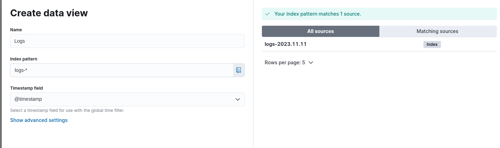

# Setup project
1. Start python app for generate logs - `python3 ./host_metrics_app/main.py`
2. Start docker containers - `docker-compose up`
3. Go to [kibana](http://127.0.0.1:5601)
4. Setup Kibana Dashboard:
- Create index (Discover -> Create index pattern) 
- Go to Discover
5. See your data 